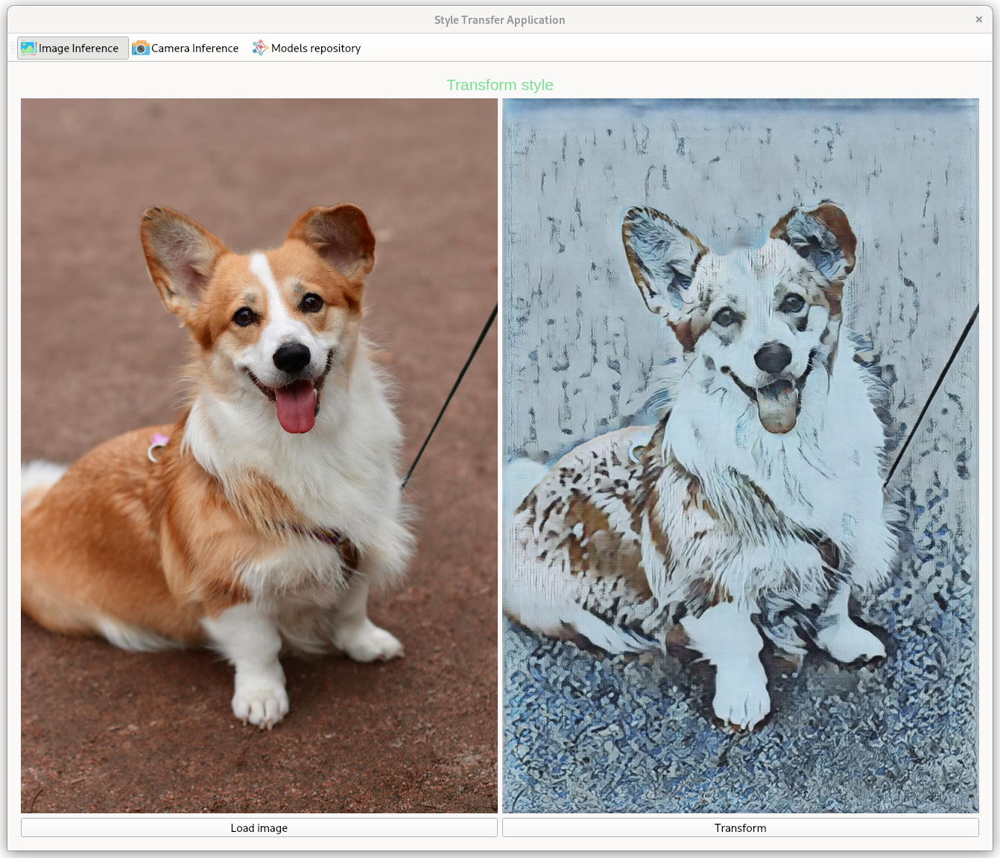
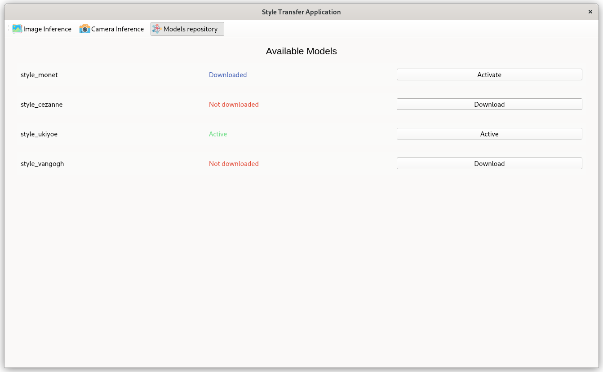

# ZPR - projekt

### Aplikacja do transferu stylu

- Patryk Filip Gryz
- Tomasz Owienko
- Opiekun projektu: dr inż. Łukasz Neumann

Realizacja 2024L

### Cel projektu

Celem projektu była implementacja aplikacji w języku C++ pozwalającej na realizację transferu stylu w na obrazie z
kamery w czasie rzeczywistym ze pomocą wytrenowanych wcześniej sieci neuronowych.

### Wykorzystane technologie

- Język C++ w standardzie `C++20`
- Biblioteka PyTorch dla języka C++ - `LibTorch`
- Pobieranie i przygotowywanie modeli - `python3` + `pytorch`
- Przetwarzanie obrazów - OpenCV
- Interfejs graficzny - Qt
- Przyspieszenie sprzętowe - CUDA
- Kompilatory - `g++`, `clang`, `MVSC`
- System budowania - CMake + Ninja
- Testy jednostkowe - Catch2
- Lintery `clang-tidy`, `cppcheck`
- Formater - `clang-format`
- Potoki CI - GitHub Actions

### Struktura projektu

Kod projektu podzielony został na dwie biblioteki - `common` i `ui` zawierające odpowiednio implementacje logiki
aplikacji oraz interfejsu graficznego. Pliki w bibliotekach rozmieszczone są wg następującej struktury:

```
<lib>
  ├ include
  │  └ <lib>
  │      ├ <name>.hpp
  │      └ <name>.hpp   
  ├ <name>.cpp
  ├ <name>.cpp
  ...
  └ CMakeLists.txt
``` 

Plik główny aplikacji wraz z głównym plikiem `CMakeLists.txt` znajdują się bezpośrednio w katalogu `src`

### Wymagania

Do poprawnej kompilacji projektu wymagane jest spełnienie następujących zależności:

- Kompilator C++ zgodny z `C++20` (`g++`, `clang` lub `mvsc`)
- CMake (≥2.25)
- Biblioteka OpenCV (testowano na wersji 4.5.5)
- Biblioteka LibTorch (testowano na wetrji 2.2.2)
- Biblioteka Qt (testowano na 6.7)
- (zalecane) CUDA 12.1
- (Unix) biblioteka `libfmt-dev` - wymaganie ze strony OpenCV
- (do pobierania modeli) `curl`
- (do przygotowań własnych modeli) środowisko języka Python (≥3.10) ze spełnionymi zależnościami z
  pliku `scripts/requirements.txt`
- (budowanie dokumentacji) Doxygen

### Kompilacja projektu

Przygotowanie projektu z użyciem systemu `CMake`:

```shell
cmake -S src --preset=<PRESET_NAME>
```

W pliku `CMakePresets.json` dostarczono dwie konfiguracje budowania dla systemów Unixowych- ze wsparciem dla CUDA lub
bez (głównie na potrzeby CI) - oraz odpowiadające im konfiguracje do testów. Wszystkie zdefiniowane konfiguracje
korzystają z systemu `Ninja` i kompilatora `g++` z szeregiem dodatkowych sprawdzeń (`-Wall -Wextra -Werror` i kilka
innych). W wersji "domyślnej" jako wartość argumentu `--preset` należy podać `unix-gcc`.

Podczas przygotowywania projektu system `CMake` pobierze bibliotekę `Catch2` oraz wygeneruje pliki potrzebne do
kompilacji. Jeśli wystąpię problem ze znalezieniem którejś z bibliotek, można jawnie wskazać jej ścieżkę za pomocą
odpowiedniej zmiennej środowiskowej:

- CUDA - `CUDACXX=/path/to/cuda/nvcc`
- LibTorch - `Torch_DIR`
- OpenCV - `OpenCV_DIR`

W przypadku problemu ze znalezieniem biblioteki Qt, wskazane jest dodatnie parametru `-DCMAKE_PREFIX_PATH=/path/to/qt`
zamiast ustawiania zmiennej środowiskowej `Qt_DIR` - może ona powodować problemu ze znalezieniem niektórych komponentów.

Kompilacja projektu:

```shell
cmake --build src/build/<PRESET-NAME>
```

Plik binarny zostanie umieszczony w podkatalogu `src/build/<PRESET-NAME>/app`. Uruchomienie aplikacji:

```shell
cd src/build/<PRESET_NAME>
./app
```

Modele w formacie TorchScript wyszukiwane są w podkatalogu `models` zlokalizowanym w obecnym katalogu roboczym. Jeśli
taki nie istnieje, zostanie on utworzony podczas pobierania pierwszego z modeli. Ponadto, do poprawnego działania 
aplikacji jest, aby w katalogu roboczym w momencie uruchamiania aplikacji istniał katalog `resources` wygenerowany w `src/build/<PRESET-NAME>`.

Uruchomienie testów (po wcześniejszej kompilacji):

```shell
cd src
ctest --preset test-unix-gcc
```

#### Budowanie dokumentacji kodu

```shell
doxygen Doxyfile
firefox doc/generated/html/index.html
```

#### Kompilacja w systemie Windows

Kompilacja pod systemem Windows przebiega identycznie do kompilacji dla systemów Unixowych. Ze względu na dystrybucję
bibliotek zarówno dla kompilatora MinGW oraz MSVC wskazane jest aby sprawdzić czy wszystkie pobrane biblioteki zgodne są
z używanym kompilatorem.

### Instrukcja użytkowania

1. Po uruchomieniu aplikacji możliwe jest przechodzenie pomiędzy stronami za pomocą narzędzi (ikonki wraz z tekstem)
   dostępnych na górnych pasku narzędziowym. Pasek narzędziowy można przesuwać oraz dockować po różnych stronach
   aplikacji
2. Na stronie "Models Repository" użytkownik może zarządzać modelami - pobierać nowe lub aktywować wybrany model do
   inferencji.
3. Na stronie "Image Inference" użytkownik może załadować własny obrazek oraz dokonać na nim transferu stylu wciskając
   przycisk "Transfer"
4. Na stronie "Camera Inference" użytkownik może uruchomić wyświetlenie podglądu transferu stylu dla obrazu z kamery
   wciskając przycisk "Start". Wyświetlanie podglądu na żywo kończy się po wciśnięciu przycisku "Stop" lub zmianie strony.

### Dostępne modele

Program wykorzystuje modele CycleGAN [publikacja](https://arxiv.org/abs/1703.10593) przystosowane do transferu
stylu.  [Implementacje modeli](https://github.com/junyanz/pytorch-CycleGAN-and-pix2pix) wraz z wagami zaproponowanymi
przez autorów publikacji przekonwertowane zostały do formatu TorchScript i umieszczone w lokalizacji sieciowej, skąd
można je pobrać za pomocą aplikacji. Są to modele:

- `style_monet`
- `style_cezanne`
- `style_ukiyoe`
- `style_vangogh`

Alternatywne, możliwe jest manualne pobranie i konwersja modelu do formatu TorchScript. Należy w tym celu przygotować
środowisko Pythona ze spełnionymi zależnościami z pliku `scripts/requirements.txt` i skorzystać ze skryptu załączonego w
repozytorium:

```shell
python3 -m pip install -r scripts/requirements.txt
python3 scripts/create_cyclegan_pretrained.py <MODEL_NAME>
```

### Dodatkowe narzędzia

W repozytorium zawarto również skrypty pozwalające wywołać lintery i formater. Uruchomienie:

```shell
./utils/reformat.sh

./utils/lint-clang-tidy.sh <PRESET_NAME>

./utils/lint-cppcheck.sh
```

Wszystkie wymienione narzędzia uruchamiane są w potokach CI i brak zgłoszonych przez nie błędów jest warunkiem
wykonania `merge` do gałęzi głównej.

### Zrzuty ekranu






### Problemy napotkane podczas realizacji projektu

- Zarządzanie zależnościami - we wczesnym etapie projektu znaczna ilość czasu upłynęła na próbach wdrożenia w projekcie
  systemu zarządzania zależnościami. Przetestowano pobieranie zależności za pomocą:
    - `nix`
        - Główny problem - błędy w udostępnianych pakietach
    - `vcpkg`
        - Wymaga kompilacji zależności ze źródeł - wyjątkowo czasochłonne, konieczne jest instalowanie wielu dodatkowych
          bibliotek (trudnych do przewidzenia) i nie ma gwarancji zakończenia się sukcesem. Pliki konfiguracyjne `vcpkg`
          zostały pozostawione w repozytorium, ale nie zaleca się korzystania z nich
    - `FetchContent_Declare` w CMake
        - Uciążliwe przy próbie wykonania "czystej" kompilacji, ostatecznie wykorzystany tylko do `Catch2`
- Kompatybilność z systemem Windows - konieczność niezależnego testowanie tej samej konfiguracji w dwóch środowiskach
- Pośrednia zależność od kodu Pythona - autorzy publikacji dostarczają jedynie wagi do modeli, same modele
  zaimplementowane są jednak w Pythonie i wymagają konwersji do formatu TorchScript. Pierwotnie zakładano, że sama
  konwersja będzie odbywała przez wywołanie osadzonego kodu Pythona, ostatecznie zrezygnowano z tego rozwiązania na
  rzecz wstępnego przygotowania modeli - upraszcza to aplikację i eliminuje niepotrzebne konwertowanie modeli za każdym
  razem w ten sam sposób
- Niska dostępność maszyn z systemem Windows w usłudze GitHub Actions - konieczność manualnego testowania
- Problemy z biblioteką Qt
    - System kompilacji biblioteki Qt powodował błędy w innych bibliotekach, co wymagało otoczenia wszystkich include'ów
      torcha zestawem makr / definicji
    - Ze względu na problemy z MOC i kompilacją klas zawierających makro Q_OBJECT zrezygnowano z wykorzystania
      definiowania własnych sygnałów, które choć bardzo przydatne, ze względu na problemy z kompilacją musiały być
      zastąpione mniej przyjazdnymi mechanikami
    - Brak Media API w domyślnej instalacji Qt spowodował zrezygowanie z wykorzystania obsługi kamery przez Qt na rzecz
      bardziej bezpośrednich odwołań
- Wydłużone czasy kompilacji oraz ograniczone wsparcie od IDE
    - Ilość zależności oraz ich wielkość spowodowała, że czas kompilacji w zależności od ustawień potrafił wynosić nawet
      5 minut, pomimo kompilacji na wielu rdzeniach
    - IDE, ze względu na mnogość definicji oraz ciągłe analizowanie kodu źródłowego nie były w stanie zapewniać stałej
      pomocy programiście - czasem zawodziły nawet w podstawowych zadaniach kolorowania składni czy podglądania
      implementacji danej klasy
  